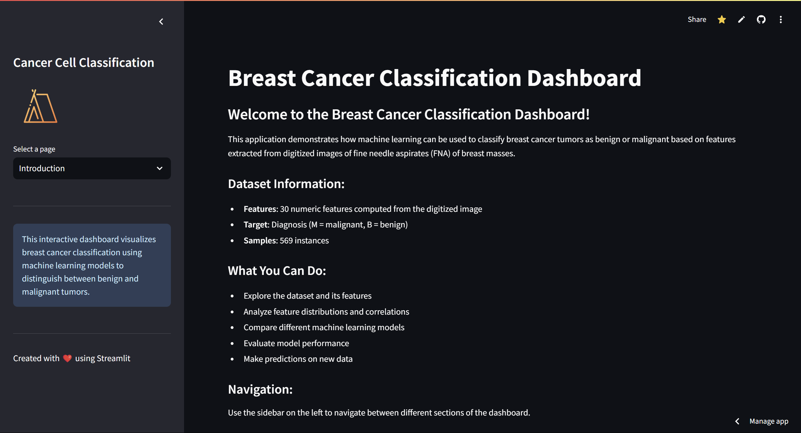

# Cancer-Cell-Classification

## Overview

This project is an interactive dashboard for visualizing breast cancer classification using machine learning models. The dashboard allows users to explore the dataset, analyze feature distributions and correlations, compare different machine learning models, evaluate model performance, and make predictions on new data.

## Features

- **Introduction**: Overview of the project and dataset information.
- **Data Explorer**: Explore the dataset with tabs for overview, class distribution, feature correlations, and feature importance.
- **Feature Analysis**: Analyze selected features with distribution and correlation visualizations.
- **Model Comparison**: Train and compare different machine learning models.
- **Model Evaluation**: Evaluate the performance of the best model with various metrics and visualizations.
- **Make Prediction**: Make predictions on new data using the trained models.

## Dataset Information

- **Features**: 30 numeric features computed from the digitized image of a fine needle aspirate (FNA) of a breast mass.
- **Target**: Diagnosis (M = malignant, B = benign)
- **Samples**: 569 instances

## Installation

1. **Clone the repository**:
   git clone https://github.com/your-username/Cancer-Cell-Classification.git
   cd Cancer-Cell-Classification

2. **Create and activate a virtual environment**:
    python -m venv venv
    venv\Scripts\activate  # On Windows

3. **Install the required packages**:
    pip install -r requirements.txt

4. **Run the Streamlit app**:
    streamlit run app.py

## Usage

**Introduction**: Provides an overview of the project and dataset information.
**Data Explorer**: Allows users to explore the dataset with tabs for overview, class distribution, feature correlations, and feature importance.
**Feature Analysis**: Enables users to analyze selected features with distribution and correlation visualizations.
**Model Comparison**: Facilitates training and comparison of different machine learning models.
**Model Evaluation**: Provides evaluation of the best model's performance with various metrics and visualizations.
**Make Prediction**: Allows users to make predictions on new data using the trained models.

## Screenshots

**Introduction**

**Data Explorer**

**Feature Analysis**

**Model Comparison**

**Model Evaluation**

**Make Prediction**

## Dashboard

You can access the live dashboard at the following URL: (<[text](https://cancer-classification-dashboard.streamlit.app/)>)

## Contibutors

Erebus(<[https://github.com/Erebuzzz]>)

## Acknowledgements

- National Cancer Institute: For the dataset and image.
- Streamlit: For providing an easy-to-use framework for building interactive dashboards.
- Seaborn: For data visualization.
- Scikit-learn: For machine learning algorithms and tools.

## Future Work

- **Model Improvements**: Experiment with different machine learning models and hyperparameters to improve classification accuracy.
- **Feature Engineering**: Explore additional feature engineering techniques to enhance model performance.
- **Deployment**: Deploy the dashboard to a cloud platform for wider accessibility.

## How to Contribute

1. Fork the repository.
2. Create a new branch for your feature or bugfix.
3. Commit your changes.
4. Push to the branch.
5. Create a pull request.